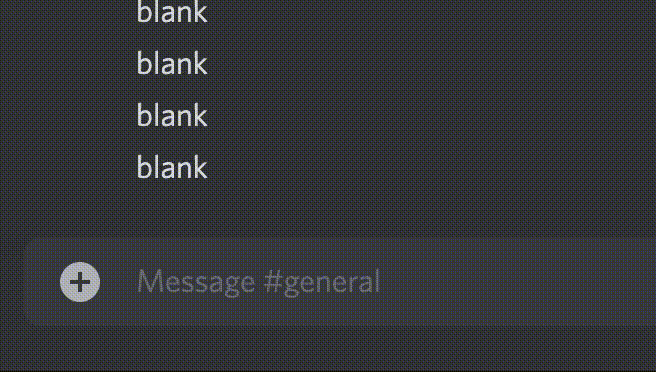
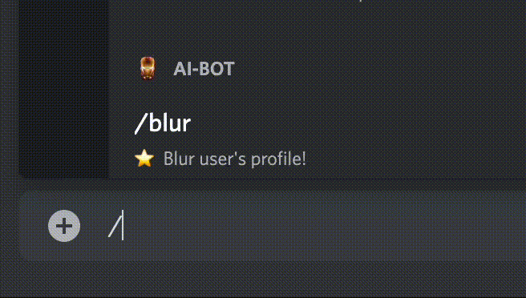
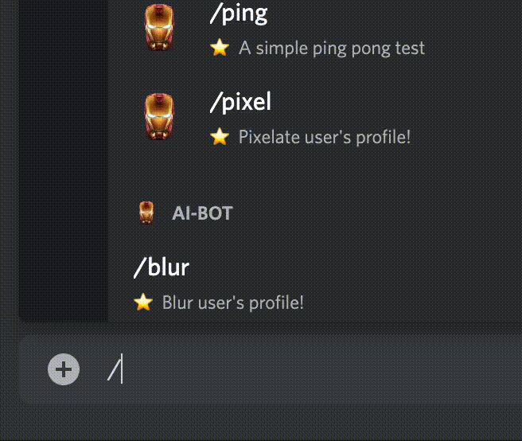
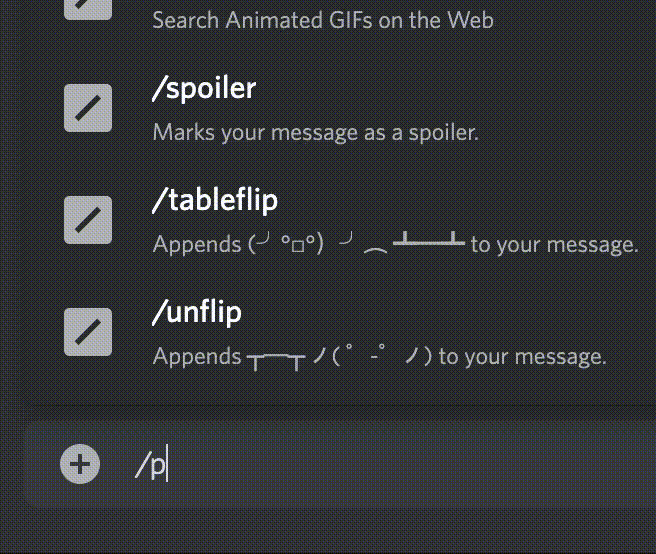
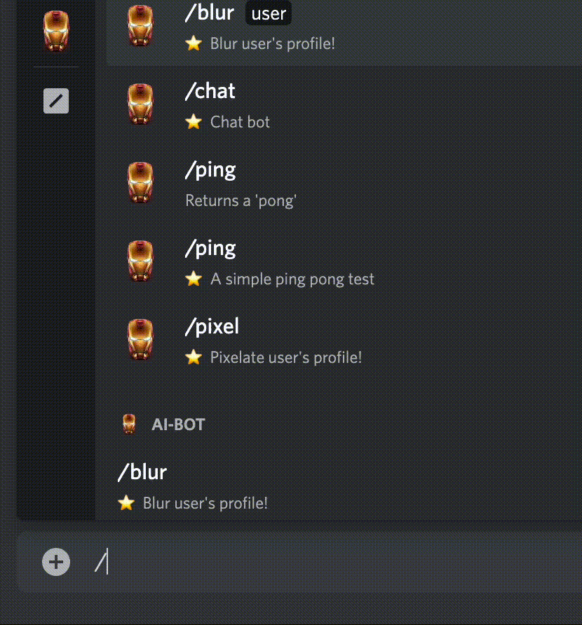

# discord-bot


**Abstract**  
Simple Discord Bot with minor features.

<br/>

---

# Requirements

## 🧑 For Users


Please join [Tony](https://discord.gg/3C8j2AZE) server.


## 🧑‍💻 For Cloners

### Environment variables

Fill environment variables as [sample.env](./sample.env).

```
# Discord
TOKEN=<Your Discord Token>
CLIENT_ID=<Your Discord Client ID>
GUILD_ID=<Your Discord Guild ID>
SERVER_ID=<Your Discord Server ID>

# Gfycat
GFYCAT_CLIENT_ID=<Your Gfycat Client ID>
GFYCAT_CLIENT_SECRET=<Your Gfycat Client Secret>
```

### Install and Run

```bash
$ nvm install
$ pnpm add . && pnpm start

# OR

$ docker build -t some-tag . && docker run some-tag
```

---

<br/>

# Commands

## ⭐️ Command `/ping`


Just type `/ping` to receive a `pong` response. (Overwrriten `/ping` command.)

<br/>

## ⭐️ Command `/chat say <Some Text>`



(_NOTE_: english only supported)

You can receive a response from your chat.

<br/>

## ⭐️ Command `/blur <user>`


You can get blurred user's profile.

<br/>

## ⭐️ Command `/pixel <user>`


You can get pixelated user's profile.

<br/>

## ⭐️ Command `/feel say <Some Text>`



(_NOTE_: english only supported)

It first analyze text sentiment and then gives you a proper gif image(`positive | neutral | negative`).
You can receive a gif response from your chat.
